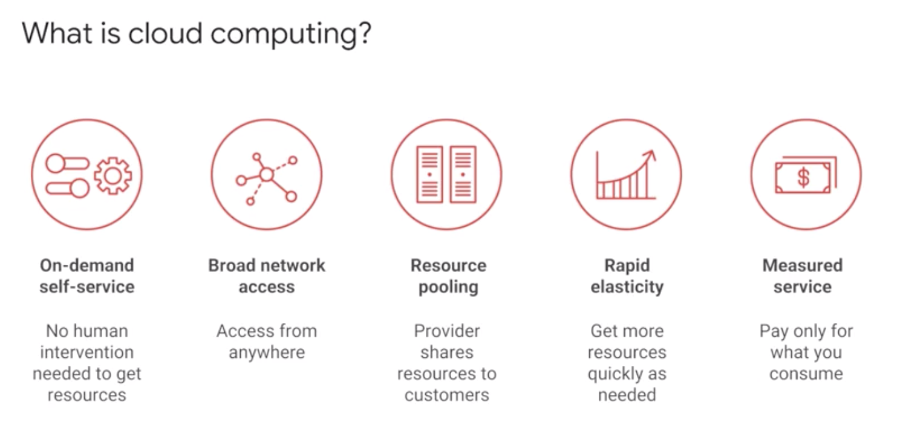
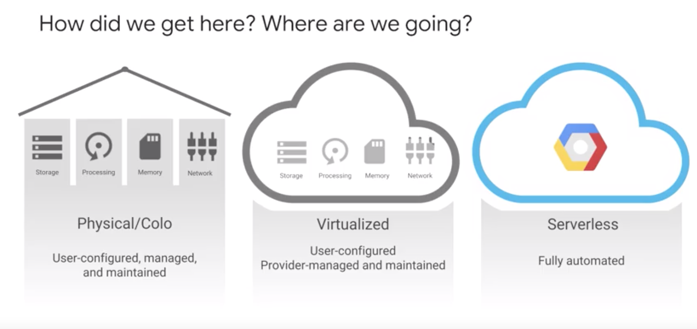
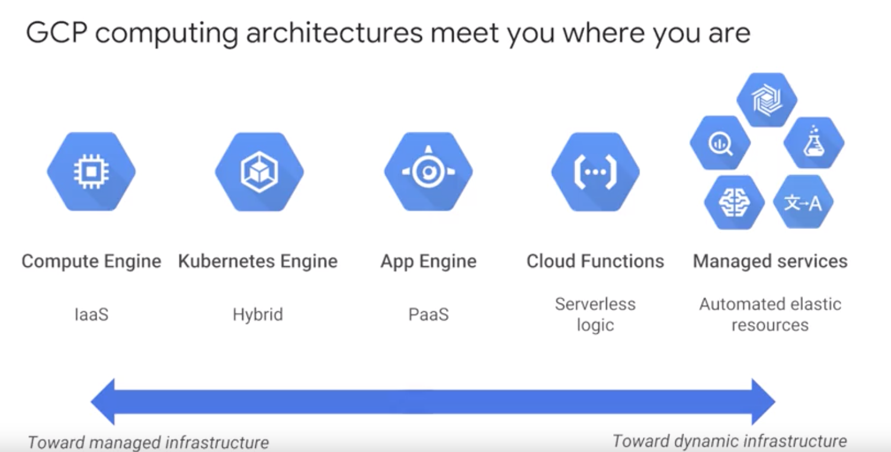
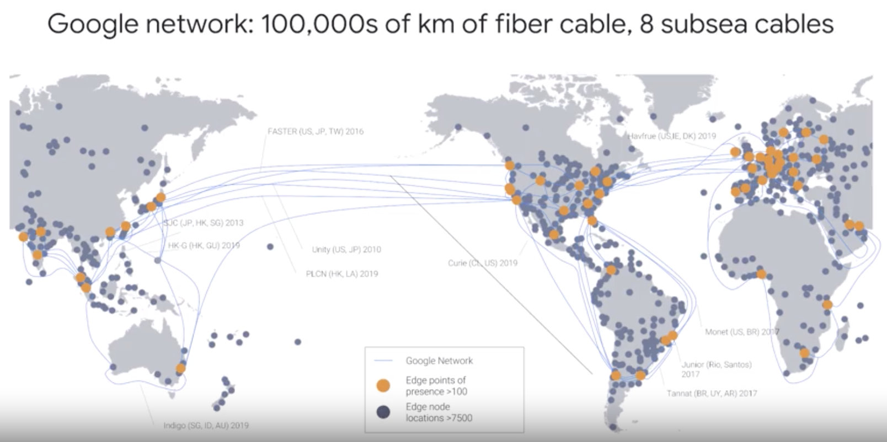
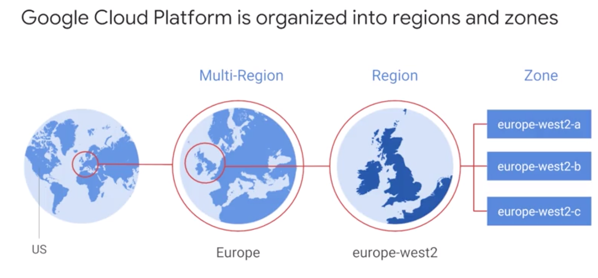
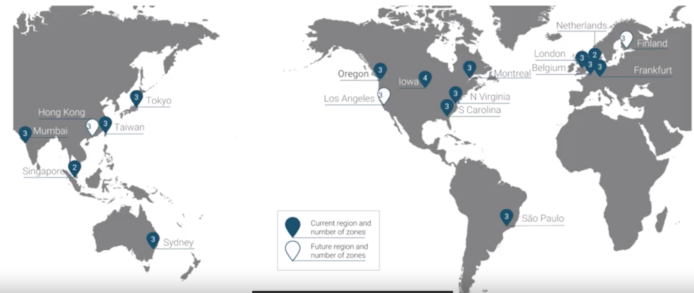
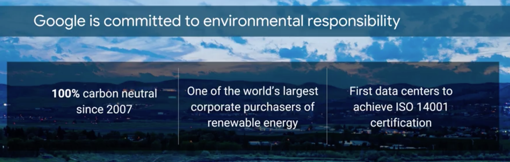
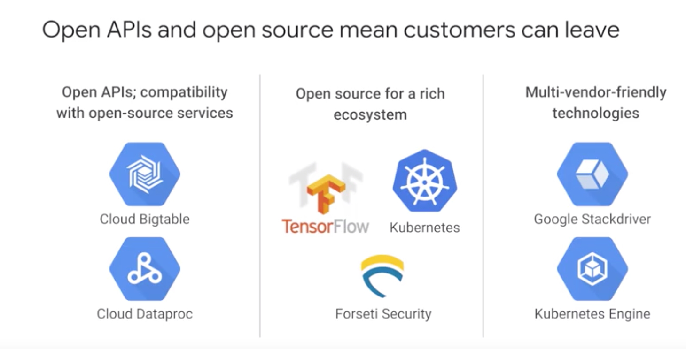
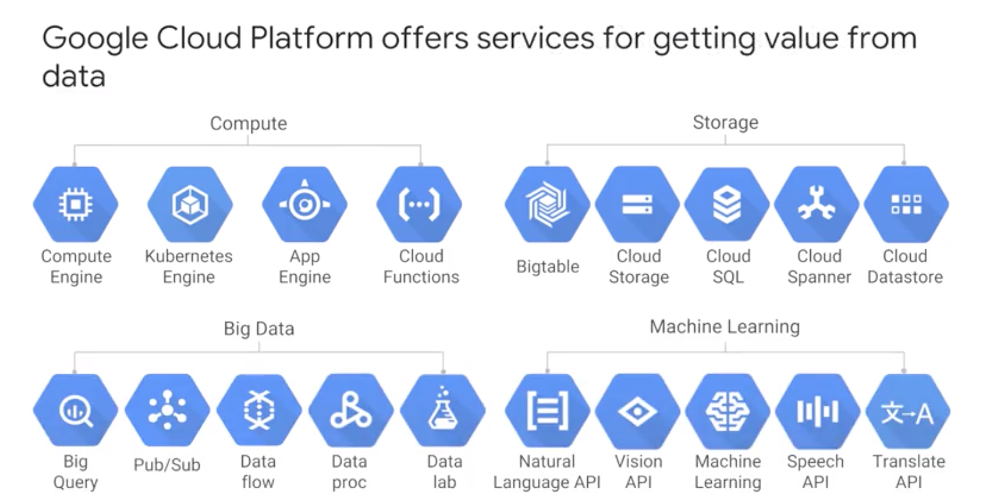
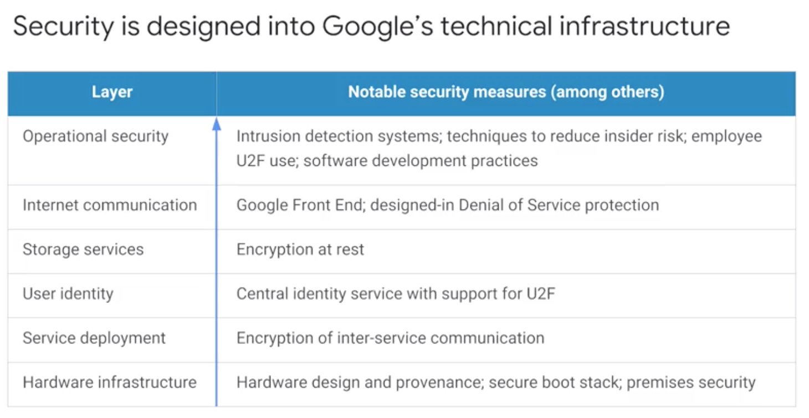

<h1>Introducting Google Cloud Platform</h1>

<h2>Welcome to GCP Fundamentals</h2>

* GCP offers 4 main kinds of services:
    * Compute
    * Storage
    * Big Data
    * Machine Learning

* Infrastructure focus on compute

<h2>What is cloud computing?</h2>

* Cloud computing is a way of using I.T that has these five equally important traits.
    * First, you get computing resources on demand and self-service. All you have to do is use a simple interface and you get the processing power, storage, and network you need.
    * Second, you access these resources over the net from anywhere you want.
    * Third, the provider of those resources has a big pool of them and allocates them to customers out that pool. Customer don't have to know or care about the exactly physical location of those resources.
    * Fouth, the resources are elastic. If you need more resources you can get more, rapidly. If you need less you can scale back.
    * Five, the customers pay only for what they use or reserve as they go.

<h2>How did we get here?</h2>

* Colocation was the first wave of the trend that brought us towards cloud computing.
* Insted of building costly capital intensive data center, they can rent space in shared facilities.

* The component of a virtualized data center match the parts of a physical data center

* About 10 years ago, Google realized that its business couldn't move fast enough within the confines of the virtualization model. Google switch to container.

<h2>Every company is a data company</h2>

* Google Cloud provides a wide variety of services for managing and getting value from data and doing that at scale.

<h2>Quiz</h2>

*  Cloud computing resources are available on-demand and self-service. (An exception: cloud computing providers typically set some limits on the amount of resources a customer can consume by default, to help customers avoid accidental runaway resource usage and charges. These limits can be raised by the cloud provider.)

* The cloud provider has a pool of resources and lets you use more or less on demand.

<h2>GCP Computing Architectures</h2>

* Infrastructure as a Service (IaaS)
    * You pay for what you allocate.

* Platform as a Service (PaaS)
    * You pay for what you use

<h2>The Google Network</h2>

* Google's Network is the largest of its kind on earth.
* The network interconnects at more than 90 Internet exchanges and more than 100 points of presence worldwide. When an Internet user sends traffic to a Google resource, Google responds to the user's request from an edge network location that will provide the lowest latency. Google's Edge-caching network cites content close to end users to minimize latency.

<h2>GCP regions and zones</h2>

* How is GCP organized?
* A zone is a deployment area for Google Cloud Platform Resources
* For Example:
    * When you launch a virtual machine in GCP using Compute Engine, it runs in a zone specify.
* Although people think of a zona as being like a GCP Data Center, that is not strictly accurate because a zone doesnt always correspond to a single physical building.
* Zones are group into regions, and you can choose which region your GCP Resources are in.
* Some services support placing resources in what we call a Multi-Region.
* For Example:
    * Google Cloud Storage, lets you place data within the Europe Multi-Region. That means, it's stored redundantly in at least two geographic locations, separeted at least 160 kilometers within Europe.
* Today, GCP has 15 regions.
* You can see at cloud.google.com to see what the total is up to today.

<h2>Environmental Responsibility</h2>

* All existing data centers use roughly two percent of the world's eletricity.

<h2>Open APIs</h2>

<h2>Why choose Google Cloud Platform</h2>

* Google Cloud Platform lets you choose from computing, storage, big data, machine learning and application services for your web, mobile, analytics and back-end solutions. It's global, it's cost effective, it's open source friendly and it's designed for security. 

<h2>Multi-layered security approach</h2>

